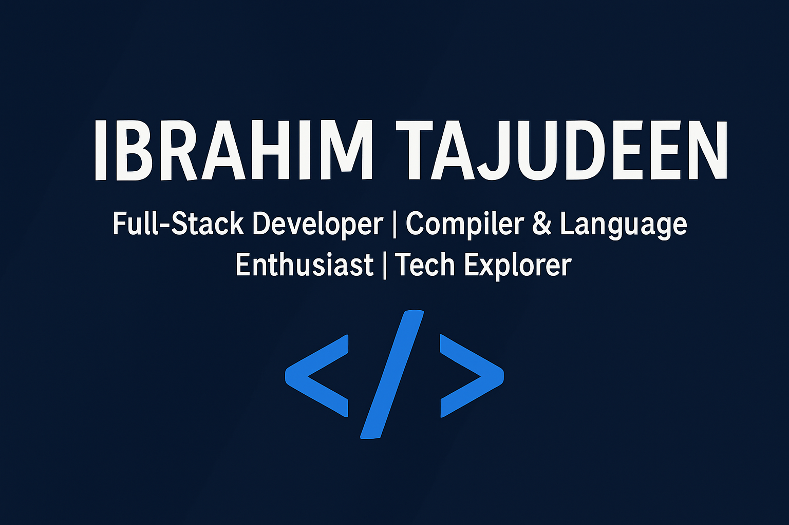

  

<h1 align="center">👋 Hi, I'm Ibrahim Tajudeen</h1>

<h3 align="center">
  Full-Stack Developer | Compiler & Language Enthusiast | Tech Explorer
</h3>

---

## 🛠️ Tech Stack & Tools  

  <!-- Core -->
  
  
  
  
  
  

  <!-- Mobile -->
  

  <!-- Web -->
  
  
  
  
  
  
  

  <!-- Databases -->
  
  

  <!-- Styling -->
  
  
  
  

  <!-- Web3 -->
  

---

## 🚀 Featured Projects  

<table>
  <tr>
    <td width="50%" valign="top">
      <h3>🏥 Hospital Management System (HMS)</h3>
      

        Multi-branch hospital management system with role-based access 
        (Super Admin, Admin, Doctors, Nurses, etc.) built with 
        <b>ASP.NET Core Razor Pages & EF Core</b>.
      

      
      
    </td>
    <td width="50%" valign="top">
      <h3>💳 Billing App</h3>
      

        A <b>C# Xamarin.Forms</b> app for buying airtime, data, cable TV 
        subscriptions, and funding accounts via virtual bank accounts.  
      

      
      
    </td>
  </tr>

  <tr>
    <td width="50%" valign="top">
      <h3>🏗️ Safe Construction Company Website</h3>
      

        A secure <b>Node.js, MongoDB, and EJS</b> platform with 
        JWT-based authentication and staff management workflows.
      

      
      
      
    </td>
    <td width="50%" valign="top">
      <h3>🖥️ KalmScript</h3>
      

        A compiled programming language built with <b>C# and C++</b>.  
        Features: memory management, JIT compilation, 
        multi-language embedding, reflection, sandboxing, and optimizations.  
        Core library: <b>KalmCoreLib</b>.
      

      
      
    </td>
  </tr>

  <tr>
    <td colspan="2" valign="top">
      <h3>📦 Custom Compressed File Format</h3>
      

        A custom file format designed to store <b>images, audio, video, text, 
        and HTML canvas content</b> with advanced encoding & compression.
      

      
      
    </td>
  </tr>
</table>

---

## 📊 GitHub Stats  

  
  

  

---

## 🤝 Let’s Connect  

  📧 <a href="mailto:donslice6@gmail.com">Gmail</a>  
  | 💼 <a href="https://www.linkedin.com/in/ibrahim-tajudeen-7328312a5/">LinkedIn</a>  
  | 🐦 <a href="https://x.com/CODE2BRAIN">Twitter/X</a>

---

  ✨ <em>“Crafting solutions from web apps to programming languages.”</em> ✨

